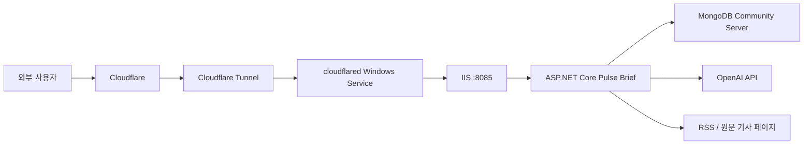

# Pulse Brief 개발 현황 문서

작성일: 2026-06-09

## 1. 프로젝트 개요

Pulse Brief는 RSS 뉴스와 원문 기사 페이지를 수집해 유사 이슈로 그룹화하고, 카테고리별 전날/주간 이슈 요약을 제공하는 개인용 뉴스 브리핑 서비스입니다.

현재 목표 사용자는 1명에서 최대 2~3명 정도이며, 개인 PC에서 IIS로 서버를 운영하고 Cloudflare Tunnel을 통해 외부 HTTPS 주소로 접근하는 구조입니다.

현재 외부 접속 주소:

```text
https://news.pulse-brief.co.kr
```

## 2. 현재 운영 구조



주요 구성:

- 도메인: `pulse-brief.co.kr`
- 공개 호스트명: `news.pulse-brief.co.kr`
- 로컬 서비스: `http://127.0.0.1:8085`
- 터널 이름: `pulse-brief-local`
- 웹 서버: IIS
- 애플리케이션 서버: ASP.NET Core
- 데이터베이스: MongoDB Community Server
- 외부 접속 방식: Cloudflare Tunnel

## 3. 기술 스택

- Backend: C# / ASP.NET Core
- Frontend: 정적 HTML, CSS, JavaScript
- Database: MongoDB
- Article parsing: AngleSharp
- AI summary: OpenAI Responses API
- Deployment: IIS, Cloudflare Tunnel
- Operations: PowerShell scripts, admin diagnostics API

## 4. 뉴스 수집 파이프라인

현재 서버 파이프라인은 다음 순서로 동작합니다.

1. RSS 피드 목록 읽기
2. RSS/Atom 기사 수집
3. 기사 저장 또는 기존 기사 갱신
4. 원문 기사 URL 접근
5. 기사 본문 및 대표 이미지 추출
6. 로컬 임베딩 생성
7. 유사 기사 그룹화
8. 대표 제목과 대표 내용 생성
9. 전날/주간 이슈 요약 생성
10. 운영 로그와 진단 상태 갱신

자동 수집은 기본적으로 10분 주기로 실행됩니다.

## 5. 데이터 저장 구조

SQLite 저장소는 제거되었고, 현재는 MongoDB를 사용합니다.

기본 연결값:

```text
mongodb://127.0.0.1:27017
```

기본 데이터베이스:

```text
pulsebrief
```

주요 컬렉션:

- `articles`: RSS 기사, 원문 URL, RSS 요약, 원문 본문, 대표 이미지, 본문 수집 상태
- `articleGroups`: 유사 기사 그룹, 카테고리, 중요도, 대표 제목, 대표 내용
- `summaries`: 전날/주간 AI 또는 로컬 요약 결과

## 6. 프론트엔드 기능

현재 UI는 다음 화면과 기능을 제공합니다.

- 이슈 요약
  - 카테고리별 전날 이슈 요약
  - 카테고리별 주간 이슈 요약
  - 관련 기사 추적 기능
- 뉴스 검색
  - 이슈 피드 목록
  - 카테고리 필터
  - 검색어 필터
  - 상세 필터
  - 정렬 옵션
  - 페이지네이션 상단/하단 배치
  - 기사 썸네일 표시
  - 관련 출처 선택
- 서비스 고지
  - 뉴스 저작권 안내
  - 개인정보와 로그 안내
  - 보안 운영 안내
  - AI 요약 기준 안내
- 공통 UI
  - 사이드바 메뉴
  - Pulse Brief 로고 및 파비콘
  - 로딩 화면
  - Footer

## 7. AI 요약 기능

OpenAI API는 전날 이슈 요약을 보강하는 용도로 사용합니다. 주간 이슈 요약은 완료 주간에 포함된 일간 요약을 기반으로 로컬에서 집계합니다.

요약 흐름:

1. 서버가 전날 이슈 그룹에서 카테고리별 키워드 분포, 출처 수, 기사 수, 중요도 점수를 계산
2. 카테고리별 상위 이슈와 대표 기사 제목/RSS 요약/본문 일부를 OpenAI 입력 후보로 선별
3. OpenAI API 키가 설정되어 있으면 전날 AI 요약 시도
4. 실패하거나 API 키가 없으면 로컬 요약 유지
5. 주간 요약은 해당 주간의 일간 요약들을 합산해 로컬 요약 생성
6. 생성된 요약은 MongoDB `summaries` 컬렉션에 저장

현재 뉴스 검색 화면에서는 원문 본문 전체를 직접 노출하지 않고, 저작권 위험을 줄이기 위해 원문 링크와 짧은 대표 내용 중심으로 표시합니다.

## 8. 보안 설정

관리자 전용 API는 `X-Admin-Token` 헤더가 일치해야 접근할 수 있습니다.

보호 대상 예시:

- `GET /api/articles`
- `GET /api/groups`
- `GET /api/admin/diagnostics`
- `POST /api/refresh`
- `POST /api/admin/fetch-missing-content`
- `POST /api/admin/fetch-missing-images`

외부 공개 환경에서는 다음 설정을 유지해야 합니다.

```text
Security:AllowLoopbackAdmin = false
```

적용된 보안 조치:

- 관리자 토큰 기반 API 보호
- 루프백 자동 관리자 권한 비활성화
- `.env`, `appsettings.Production.json` Git 제외
- IIS 배포 시 운영 설정 파일 보존
- SSRF 위험 완화를 위한 내부망/localhost URL 차단
- 기본 보안 헤더 적용
  - `X-Content-Type-Options`
  - `X-Frame-Options`
  - `Referrer-Policy`
  - `Permissions-Policy`

## 9. 배포 상태

현재 배포 방식:

- 개인 PC에서 IIS 실행
- MongoDB Windows 서비스 실행
- Cloudflare Tunnel로 외부 HTTPS 연결

재부팅 테스트 결과:

- `cloudflared`: 자동 시작 정상
- `MongoDB`: 자동 시작 정상
- `IIS / W3SVC`: 자동 시작 정상
- 외부 URL 자동 복구 정상
- 관리자 API 무토큰 접근 차단 정상

현재 구조에서는 PC 전원이 꺼지면 외부 접속도 중단됩니다. PC가 켜지고 인터넷이 연결되어 있으면 배포는 계속 유지됩니다.

## 10. 운영 스크립트

주요 운영 스크립트:

- `tools/deploy-iis.ps1`: IIS 배포 반영
- `tools/setup-iis.ps1`: IIS 사이트 초기 설정
- `tools/test-deployment.ps1`: 배포 후 상태 점검
- `tools/deploy-collector.ps1`: 웹 서버와 분리된 Collector 운영 폴더 배포
- `tools/install-collector-task.ps1`: Windows 시작 시 Collector를 자동 실행하는 작업 스케줄러 등록
- `tools/backup-mongodb.ps1`: MongoDB 백업
- `tools/restore-mongodb.ps1`: MongoDB 복구

외부 배포 점검:

```powershell
powershell -NoProfile -ExecutionPolicy Bypass -File .\tools\test-deployment.ps1 -BaseUrl https://news.pulse-brief.co.kr
```

로컬 배포 점검:

```powershell
powershell -NoProfile -ExecutionPolicy Bypass -File .\tools\test-deployment.ps1
```

## 11. 운영 진단

관리자 전용 진단 API:

```text
GET /api/admin/diagnostics
```

진단 API는 다음 정보를 제공합니다.

- 서버 시작 시각
- 업타임
- RSS 피드 수
- 전체 기사 수
- 중복 제거 기준 유효 기사 수
- 그룹 수
- 요약 수
- 본문 수집 성공률/실패율
- 이미지 수집률
- 카테고리별 그룹 수
- 마지막 파이프라인 실행 상태
- 운영 경고
- 최근 운영 이벤트

현재 외부 배포 검토 결과:

- 외부 첫 화면: 정상
- `/api/health`: 정상
- `/api/briefs`: 정상
- 관리자 API 무토큰 접근: 401 정상 차단
- 운영 경고: 0

## 12. 운영 로그

운영 이벤트는 기본적으로 실행 폴더의 `logs/` 아래에 날짜별 JSON Lines 형식으로 저장됩니다.

기록 대상:

- 예약 수집 시작
- 수동 수집 요청
- 파이프라인 시작
- 파이프라인 성공
- 파이프라인 실패
- 파이프라인 취소

진단 API에서도 현재 프로세스의 최근 이벤트를 확인할 수 있습니다.

## 13. 백업과 복구

MongoDB 백업/복구 스크립트는 준비되어 있습니다.

백업:

```powershell
powershell -NoProfile -ExecutionPolicy Bypass -File .\tools\backup-mongodb.ps1
```

복구:

```powershell
powershell -NoProfile -ExecutionPolicy Bypass -File .\tools\restore-mongodb.ps1 -BackupPath .\backups\mongodb\pulsebrief_YYYYMMDD_HHMMSS -ConfirmRestore
```

주의:

- `mongodump`, `mongorestore`가 필요합니다.
- MongoDB Database Tools 설치가 필요할 수 있습니다.
- `backups/`는 Git에 포함하지 않습니다.

## 14. 저작권 고려사항

외부 공개 배포 상태에서는 뉴스 원문 본문 노출을 최소화해야 합니다.

현재 방향:

- 원문 전체 본문은 DB에는 저장하되, 화면에서는 직접 긴 본문 노출을 피함
- 뉴스 검색 화면은 원문 링크와 짧은 대표 내용 중심
- 전날/주간 요약은 수집 데이터를 기반으로 요약 정보 제공
- 출처 링크를 명확히 제공

향후에도 언론사 기사 원문을 길게 재게시하는 방식은 피하는 것이 좋습니다.

## 15. 현재 확인된 운영 지표

최근 외부 진단 기준:

- 기사 수: 약 7천 건 이상
- 유효 기사 수: 약 7천 건 수준
- 이슈 그룹 수: 약 6천 건 이상
- RSS 피드 수: 161개
- 본문 수집 성공률: 약 55%
- 본문 수집 실패율: 약 45%
- 운영 경고: 0

본문 수집 실패율은 아직 높은 편입니다. 언론사별 본문 추출 규칙을 보강하면 개선할 수 있습니다.

## 16. 남은 작업

우선순위가 높은 작업:

1. 관리자용 운영 상태 화면 추가
2. MongoDB Database Tools 설치 및 실제 백업 테스트
3. 오래된 기사/로그 정리 정책 추가
4. 언론사별 본문 추출 품질 개선
5. 카테고리 오분류 개선
6. 중복 기사 판단 정확도 개선
7. RSS 미지원 사이트 스크래핑 구조 설계
8. 수집 실패나 요약 실패 알림 기능 추가
9. 테스트 코드 보강

추천 다음 작업:

```text
관리자용 운영 상태 화면 추가
```

이미 `/api/admin/diagnostics`가 준비되어 있으므로, 이 데이터를 UI에서 볼 수 있게 만들면 운영 편의성이 크게 좋아집니다.
